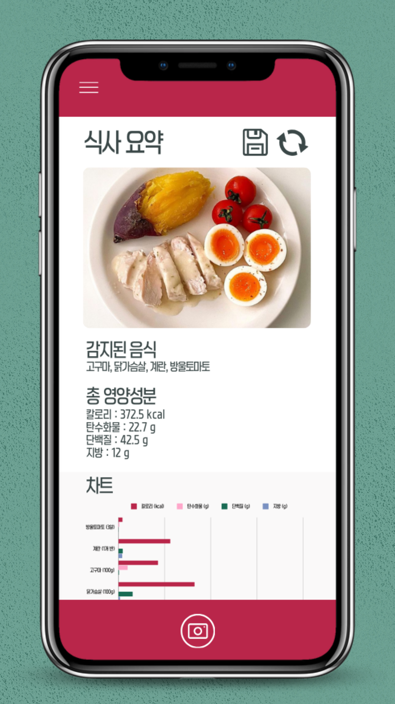

# -컴퓨터비전 객체인식 과제-
참고 깃허브: https://github.com/JangMinSeong/Diet101

##  1. 개요
해당 시스템의 주요 기능은 식단 관리의 편의성을 제공하기 위해 영양성분을 분석하는 것입니다. 사용자가 섭취할 음식을 사진을 찍으면 영양성분의 퍼센트(%)를 확인할 수 있습니다.

##  2. 팀원 소개
[QA반] 20231584 이정수 / 20231596 최소원 / 20232511 김다현 / 20232506 윤채영

## 3. 과제 목표(이미지)

## 4. Yolov11n 모델
사용자가 촬영한 음식 사진에서 개별 음식 객체를 구분하고 인식하기 위해 Yolov11n 모델을 활용했습니다. Yolov11n은 최신 객체 탐지 모델로, 다양한 객체를 인식하도록 사전 학습되어 있습니다. 하지만 본 서비스는 음식만을 인식하도록 설계되었기에, 서비스 목적에 맞는 fine-tuning이 필요했습니다.

특히, 단순히 음식을 '음식'으로만 인식하는 것이 아니라, '삼겹살', '된장찌개' 등과 같이 세부적인 음식 이름까지 인식해야 했기에, 이를 위한 추가적인 fine-tuning이 필요했습니다. 이를 위해 다음 데이터셋을 활용했습니다:

Kaggle의 'Food-11 image dataset'

총 16,643개의 음식 이미지를 포함하며, Yolov11n이 음식만 인식할 수 있도록 초기 fine-tuning에 사용되었습니다.
AI Hub의 '건강관리를 위한 음식 이미지'

총 3,000,000개의 이미지가 있었으나, 클래스 수가 3,500개로 너무 방대하여 하드웨어적으로 학습에 부담이 되었습니다.
이를 해결하기 위해 클래스를 154개로 축소하고, 데이터셋을 총 272,783개의 이미지로 줄여 최적화된 fine-tuning을 진행했습니다.
이를 통해 Yolov11n 모델이 특정 음식 객체를 보다 정확하게 구분하고 세부 명칭까지 인식할 수 있도록 학습을 완료했습니다.

## 5. 영양성분 인식 모델 (EasyOCR) - 자료: https://patents.google.com/patent/KR20210092552A/ko
성분표를 인식하고 서비스에 자동으로 기록하기 위해 EasyOCR 모델을 활용했습니다. Ai hub의 '의약품, 화장품 패키징 OCR 데이터'를 활용하여 50,000개의 레이블링 데이터를 학습시켰습니다. kaggle이나 Ai hub 에서도 성분표 데이터셋은 확보할 수가 없었고 그나마 의약품, 화장품에 있는 단어들이 성분표와 유사한 면이 있다 판단하여 선정하게 되었습니다. 마지막으로 '탄수화물', '포화지방' 등등의 성분표에만 있는 단어들을 직접 캡처하고 레이블링한 데이터 800개를 활용하여 fine tunning을 진행했습니다. Training data와 Validation data는 80:20 비율로 나눴고 Epoch는 3155로 학습을 진행했지만 생각보다 결과가 좋진 않았습니다.

## 6. 기능 (음식 사진 인식하는 단계)
